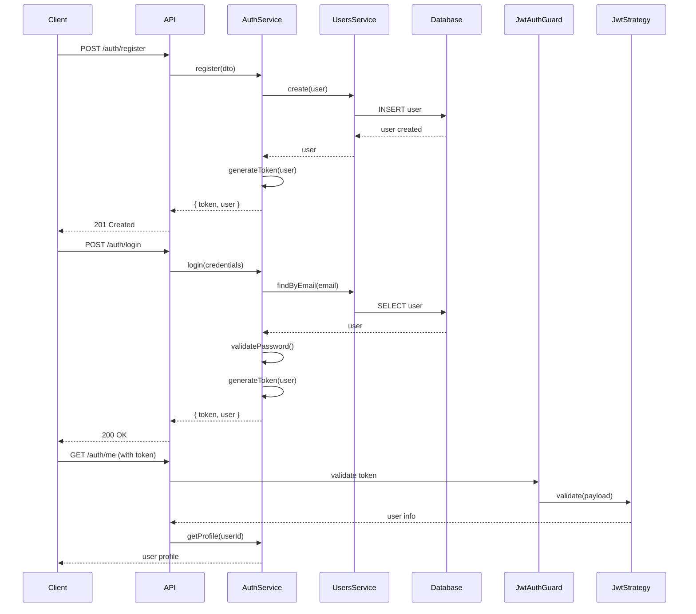
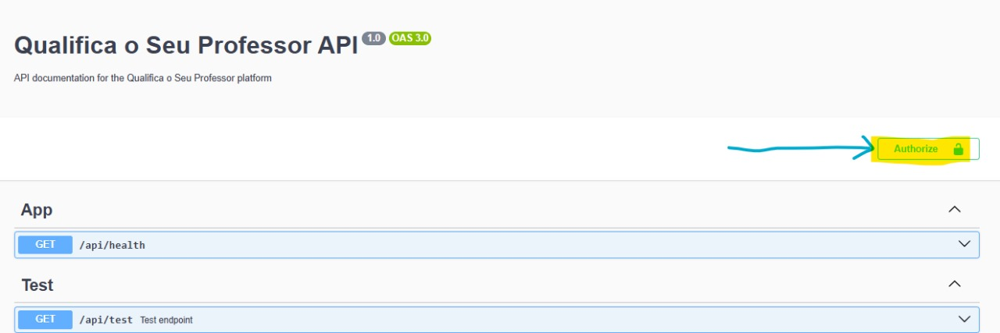
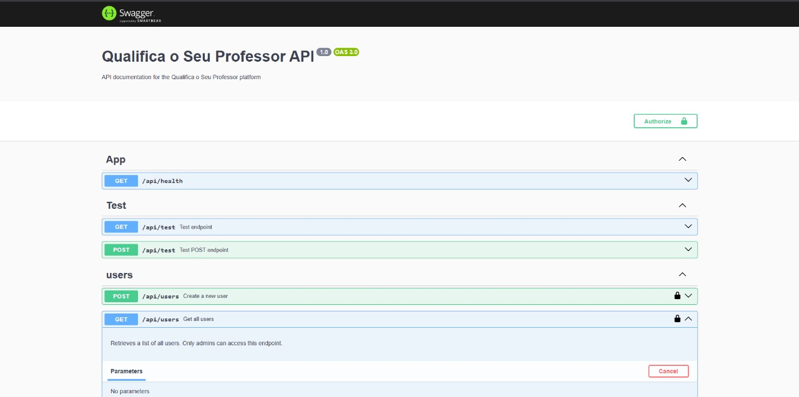
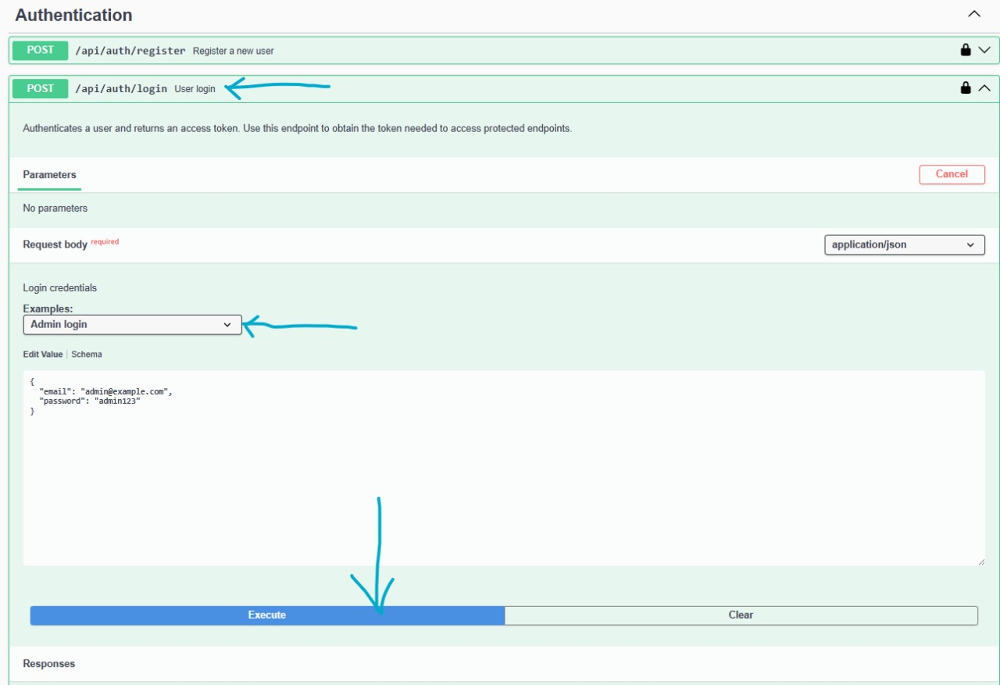
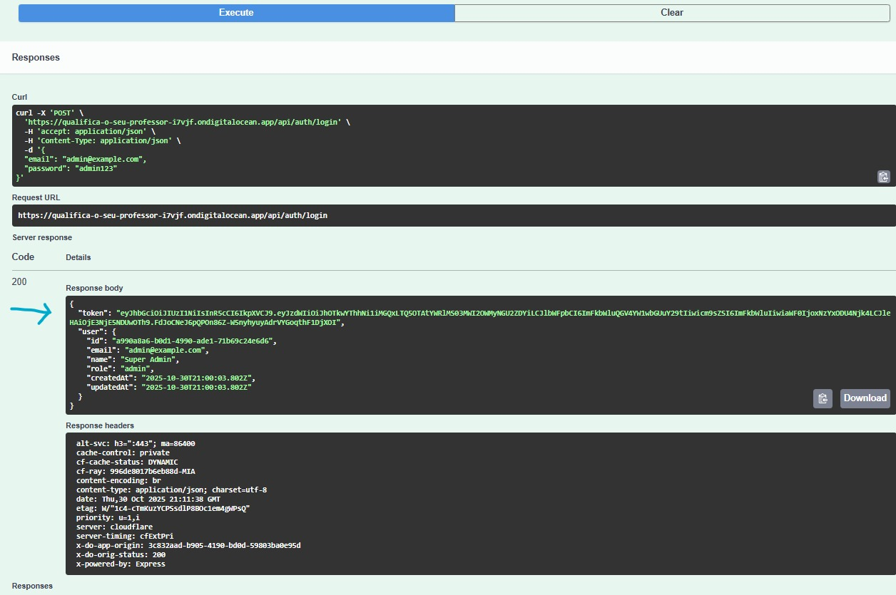
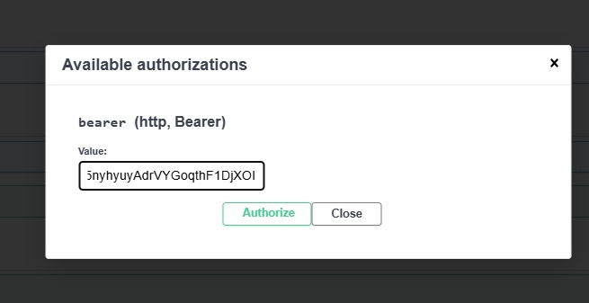

# Informe Técnico - API Qualifica o Seu Professor

**Versión:** 1.0.0  
**Fecha:** Octubre 2025  
**Framework:** NestJS v11  
**Base de Datos:** PostgreSQL  
**Autenticación:** JWT (JSON Web Tokens)

**Enlace** https://github.com/Sebas41/qualifica-o-seu-professor-2

---

## Tabla de Contenidos

1. [Resumen Ejecutivo](#resumen-ejecutivo)
2. [Arquitectura de la API](#arquitectura-de-la-api)
3. [Sistema de Autenticación](#sistema-de-autenticación)
4. [Sistema de Autorización](#sistema-de-autorización)
5. [Persistencia de Datos](#persistencia-de-datos)
6. [Endpoints de la API](#endpoints-de-la-api)
7. [Pruebas Unitarias](#pruebas-unitarias)
8. [Conclusiones](#conclusiones)

---

## 1. Resumen Ejecutivo

La API **Qualifica o Seu Professor** es una plataforma RESTful desarrollada con NestJS que permite a estudiantes calificar y evaluar profesores universitarios. El sistema implementa un control de acceso basado en roles (RBAC), autenticación mediante JWT y persistencia de datos con TypeORM y PostgreSQL.

### Funcionalidades Principales:
- Registro e inicio de sesión de usuarios
- Gestión de universidades (CRUD completo)
- Gestión de profesores (CRUD completo)
- Sistema de calificaciones y comentarios
- Cálculo de rating promedio por profesor{{commentId}}
- Control de acceso basado en roles
- Documentación automática con Swagger/OpenAPI

---

## 2. Arquitectura de la API

### 2.1 Estructura Modular

La API sigue el patrón arquitectónico modular de NestJS:

```
src/
├── auth/              # Autenticación y JWT
│   ├── auth.controller.ts
│   ├── auth.service.ts
│   ├── auth.module.ts
│   ├── strategies/
│   │   └── jwt.strategy.ts
│   └── dto/
│       ├── login.dto.ts
│       └── register.dto.ts
│
├── users/             # Gestión de usuarios
│   ├── users.controller.ts
│   ├── users.service.ts
│   ├── users.module.ts
│   └── entities/
│       └── user.entity.ts
│
├── universities/      # Gestión de universidades
│   ├── universities.controller.ts
│   ├── universities.service.ts
│   ├── universities.module.ts
│   └── entities/
│       └── university.entity.ts
│
├── professors/        # Gestión de profesores
│   ├── professors.controller.ts
│   ├── professors.service.ts
│   ├── professors.module.ts
│   └── entities/
│       └── professor.entity.ts
│
├── comments/          # Calificaciones y comentarios
│   ├── comments.controller.ts
│   ├── comments.service.ts
│   ├── comments.module.ts
│   └── entities/
│       └── comment.entity.ts
│
├── common/            # Recursos compartidos
│   ├── decorators/
│   │   ├── public.decorator.ts
│   │   └── roles.decorator.ts
│   ├── guards/
│   │   ├── jwt-auth.guard.ts
│   │   ├── roles.guard.ts
│   │   └── optional-auth.guard.ts
│   └── enums/
│       └── role.enum.ts
│
└── seed/              # Datos de prueba
    ├── seed.controller.ts
    ├── seed.service.ts
    └── seed.module.ts
```

### 2.2 Tecnologías Utilizadas

| Tecnología | Versión | Propósito |
|------------|---------|-----------|
| NestJS | 11.x | Framework backend |
| TypeScript | 5.x | Lenguaje de programación |
| TypeORM | 0.3.x | ORM para PostgreSQL |
| PostgreSQL | 14+ | Base de datos relacional |
| Passport JWT | 10.x | Estrategia de autenticación |
| bcrypt | 5.x | Hash de contraseñas |
| class-validator | 0.14.x | Validación de DTOs |
| Swagger/OpenAPI | 7.x | Documentación automática |
| Jest | 29.x | Framework de testing |

---

## 3. Sistema de Autenticación

### 3.1 Implementación JWT

La autenticación se implementa mediante JSON Web Tokens (JWT) utilizando Passport.js:

**Componentes principales:**

1. **JWT Strategy** (`jwt.strategy.ts`):
```typescript
@Injectable()
export class JwtStrategy extends PassportStrategy(Strategy) {
  constructor(
    private readonly configService: ConfigService,
    private readonly usersService: UsersService,
  ) {
    super({
      jwtFromRequest: ExtractJwt.fromAuthHeaderAsBearerToken(),
      ignoreExpiration: false,
      secretOrKey: configService.get('JWT_SECRET', 'defaultSecret'),
    });
  }

  async validate(payload: JwtPayload) {
    return {
      id: payload.sub,
      email: payload.email,
      role: payload.role,
    };
  }
}
```

2. **JWT Guard** (`jwt-auth.guard.ts`):
```typescript
@Injectable()
export class JwtAuthGuard extends AuthGuard('jwt') {
  constructor(private reflector: Reflector) {
    super();
  }

  canActivate(context: ExecutionContext) {
    const isPublic = this.reflector.getAllAndOverride<boolean>(IS_PUBLIC_KEY, [
      context.getHandler(),
      context.getClass(),
    ]);
    if (isPublic) {
      return true;
    }
    return super.canActivate(context);
  }
}
```

### 3.2 Flujo de Autenticación



### 3.3 Seguridad de Contraseñas

- **Hash:** Bcrypt con salt rounds = 10
- **Validación:** Mínimo 6 caracteres
- **Almacenamiento:** Solo el hash se guarda en la base de datos
- **Respuestas:** Las contraseñas nunca se exponen en las respuestas de la API

---

## 4. Sistema de Autorización

### 4.1 Roles de Usuario

```typescript
export enum UserRole {
  ADMIN = 'admin',
  STUDENT = 'student',
}
```

### 4.2 Guards de Autorización

**Roles Guard** (`roles.guard.ts`):
```typescript
@Injectable()
export class RolesGuard implements CanActivate {
  constructor(private reflector: Reflector) {}

  canActivate(context: ExecutionContext): boolean {
    const requiredRoles = this.reflector.getAllAndOverride<UserRole[]>(
      ROLES_KEY,
      [context.getHandler(), context.getClass()],
    );
    
    if (!requiredRoles) {
      return true;
    }
    
    const { user } = context.switchToHttp().getRequest();
    return requiredRoles.some((role) => user.role === role);
  }
}
```

### 4.3 Decoradores Personalizados

1. **@Public()**: Marca endpoints como públicos (no requieren autenticación)
2. **@Roles(UserRole.ADMIN)**: Restringe acceso a roles específicos

### 4.4 Matriz de Permisos

| Recurso | Endpoint | Admin | Student | Público |
|---------|----------|-------|---------|---------|
| **Auth** |
| | POST /auth/register | ✅ | ✅ | ✅ |
| | POST /auth/login | ✅ | ✅ | ✅ |
| | GET /auth/me | ✅ | ✅ | ❌ |
| **Users** |
| | GET /users | ✅ | ❌ | ❌ |
| | GET /users/:id | ✅ | ❌ | ❌ |
| | POST /users | ✅ | ❌ | ❌ |
| | PATCH /users/:id | ✅ | ❌ | ❌ |
| | DELETE /users/:id | ✅ | ❌ | ❌ |
| **Universities** |
| | GET /universities | ✅ | ✅ | ✅ |
| | GET /universities/:id | ✅ | ✅ | ✅ |
| | POST /universities | ✅ | ❌ | ❌ |
| | PATCH /universities/:id | ✅ | ❌ | ❌ |
| | DELETE /universities/:id | ✅ | ❌ | ❌ |
| **Professors** |
| | GET /professors | ✅ | ✅ | ✅ |
| | GET /professors/:id | ✅ | ✅ | ✅ |
| | POST /professors | ✅ | ❌ | ❌ |
| | PATCH /professors/:id | ✅ | ❌ | ❌ |
| | DELETE /professors/:id | ✅ | ❌ | ❌ |
| **Comments** |
| | GET /comments | ✅ | ✅ | ✅ |
| | GET /comments/:id | ✅ | ✅ | ✅ |
| | POST /comments | ✅ | ✅ | ❌ |
| | PATCH /comments/:id | ✅ | 👤 Owner | ❌ |
| | DELETE /comments/:id | ✅ | 👤 Owner | ❌ |
| | GET /comments/professor/:id/rating | ✅ | ✅ | ✅ |

---

## 5. Persistencia de Datos

### 5.1 Modelo de Datos

**Diagrama Entidad-Relación:**

```
┌─────────────────┐
│   University    │
├─────────────────┤
│ id (PK)         │
│ name            │
│ country         │
│ city            │
│ createdAt       │
│ updatedAt       │
└─────────────────┘
        │
        │ 1:N
        ▼
┌─────────────────┐         ┌─────────────────┐
│   Professor     │         │      User       │
├─────────────────┤         ├─────────────────┤
│ id (PK)         │         │ id (PK)         │
│ name            │         │ email (unique)  │
│ department      │         │ password        │
│ universityId(FK)│         │ name            │
│ createdAt       │         │ role            │
│ updatedAt       │         │ createdAt       │
└─────────────────┘         │ updatedAt       │
        │                   └─────────────────┘
        │ 1:N                       │
        │                           │ 1:N
        │         ┌─────────────────▼────────┐
        └────────►│      Comment             │
                  ├──────────────────────────┤
                  │ id (PK)                  │
                  │ content                  │
                  │ rating (1-5)             │
                  │ professorId (FK)         │
                  │ studentId (FK)           │
                  │ createdAt                │
                  │ updatedAt                │
                  └──────────────────────────┘
```

### 5.2 Entidades TypeORM

**User Entity:**
```typescript
@Entity({ name: 'users' })
export class User {
  @PrimaryGeneratedColumn('uuid')
  id!: string;

  @Column({ unique: true })
  email!: string;

  @Column()
  password!: string;

  @Column({ length: 100 })
  name!: string;

  @Column({ type: 'enum', enum: UserRole, default: UserRole.STUDENT })
  role!: UserRole;

  @CreateDateColumn({ name: 'created_at' })
  createdAt!: Date;

  @UpdateDateColumn({ name: 'updated_at' })
  updatedAt!: Date;
}
```

**University Entity:**
```typescript
@Entity({ name: 'universities' })
export class University {
  @PrimaryGeneratedColumn('uuid')
  id!: string;

  @Column({ length: 120 })
  name!: string;

  @Column({ nullable: true })
  country?: string;

  @Column({ nullable: true })
  city?: string;

  @OneToMany(() => Professor, (professor) => professor.university)
  professors!: Professor[];

  @CreateDateColumn({ name: 'created_at' })
  createdAt!: Date;

  @UpdateDateColumn({ name: 'updated_at' })
  updatedAt!: Date;
}
```

**Professor Entity:**
```typescript
@Entity({ name: 'professors' })
export class Professor {
  @PrimaryGeneratedColumn('uuid')
  id!: string;

  @Column({ length: 100 })
  name!: string;

  @Column({ length: 100 })
  department!: string;

  @Column({ name: 'university_id' })
  universityId!: string;

  @ManyToOne(() => University, (university) => university.professors, {
    onDelete: 'CASCADE',
  })
  @JoinColumn({ name: 'university_id' })
  university!: University;

  @OneToMany(() => Comment, (comment) => comment.professor)
  comments!: Comment[];

  @CreateDateColumn({ name: 'created_at' })
  createdAt!: Date;

  @UpdateDateColumn({ name: 'updated_at' })
  updatedAt!: Date;
}
```

**Comment Entity:**
```typescript
@Entity({ name: 'comments' })
export class Comment {
  @PrimaryGeneratedColumn('uuid')
  id!: string;

  @Column({ type: 'text' })
  content!: string;

  @Column({ type: 'int' })
  rating!: number; // 1-5

  @Column({ name: 'professor_id' })
  professorId!: string;

  @Column({ name: 'student_id' })
  studentId!: string;

  @ManyToOne(() => Professor, (professor) => professor.comments, {
    onDelete: 'CASCADE',
  })
  @JoinColumn({ name: 'professor_id' })
  professor!: Professor;

  @ManyToOne(() => User, { onDelete: 'CASCADE' })
  @JoinColumn({ name: 'student_id' })
  student!: User;

  @CreateDateColumn({ name: 'created_at' })
  createdAt!: Date;

  @UpdateDateColumn({ name: 'updated_at' })
  updatedAt!: Date;
}
```

### 5.3 Configuración de TypeORM

```typescript
TypeOrmModule.forRoot({
  type: 'postgres',
  host: process.env.DB_HOST || 'localhost',
  port: parseInt(process.env.DB_PORT || '5432'),
  username: process.env.DB_USER || 'postgres',
  password: process.env.DB_PASS || 'postgres',
  database: process.env.DB_NAME || 'qualifica',
  entities: [User, University, Professor, Comment],
  synchronize: process.env.DB_SYNC === 'true', // Solo en desarrollo
  logging: process.env.NODE_ENV === 'development',
})
```

### 5.4 Relaciones y Cascadas

- **Universidad → Profesor**: Relación 1:N con `CASCADE DELETE`
- **Profesor → Comentario**: Relación 1:N con `CASCADE DELETE`
- **Usuario → Comentario**: Relación 1:N con `CASCADE DELETE`
- **Restricción única**: Un estudiante solo puede comentar una vez por profesor

---

## 6. Endpoints de la API

> **Nota importante sobre autenticación:** Los endpoints protegidos requieren autenticación mediante JWT. Para obtener el token, primero debes hacer login en `POST /api/auth/login` (o registrarte en `POST /api/auth/register`). El token se debe incluir en el header de todas las peticiones protegidas:
>
> ```
> Authorization: Bearer <tu-token-jwt>
> ```
>
> **En Swagger:** Usa el botón **"Authorize"** (🔓) en la esquina superior derecha para pegar tu token. Esto te permitirá probar todos los endpoints protegidos directamente desde la interfaz de Swagger.

### 6.1 Módulo de Autenticación

#### **POST /api/auth/register**
Registra un nuevo usuario en el sistema.

**Acceso:** Público

**Request Body:**
```json
{
  "email": "student@example.com",
  "password": "password123",
  "name": "Juan Pérez",
  "role": "student"
}
```

**Validaciones:**
- Email válido y único
- Password mínimo 6 caracteres
- Name entre 2-100 caracteres
- Role: `admin` o `student` (solo admins pueden crear otros admins)

**Response 201:**
```json
{
  "accessToken": "eyJhbGciOiJIUzI1NiIsInR5cCI6IkpXVCJ9...",
  "user": {
    "id": "uuid",
    "email": "student@example.com",
    "name": "Juan Pérez",
    "role": "student",
    "createdAt": "2025-10-30T12:00:00.000Z",
    "updatedAt": "2025-10-30T12:00:00.000Z"
  }
}
```

**Errores:**
- `400` - Datos inválidos
- `409` - Email ya registrado
- `403` - Solo admins pueden crear otros admins

---

#### **POST /api/auth/login**
Autentica un usuario y devuelve un token JWT.

**Acceso:** Público

**Request Body:**
```json
{
  "email": "student@example.com",
  "password": "password123"
}
```

**Response 200:**
```json
{
  "token": "eyJhbGciOiJIUzI1NiIsInR5cCI6IkpXVCJ9...",
  "user": {
    "id": "uuid",
    "email": "student@example.com",
    "name": "Juan Pérez",
    "role": "student"
  }
}
```

**Errores:**
- `400` - Datos inválidos
- `401` - Credenciales incorrectas

---

#### **GET /api/auth/me**
Obtiene el perfil del usuario autenticado.

**Acceso:** Requiere autenticación

**Headers:**
```
Authorization: Bearer {token}
```

**Response 200:**
```json
{
  "id": "uuid",
  "email": "student@example.com",
  "name": "Juan Pérez",
  "role": "student",
  "createdAt": "2025-10-30T12:00:00.000Z",
  "updatedAt": "2025-10-30T12:00:00.000Z"
}
```

**Errores:**
- `401` - Token inválido o expirado

---

### 6.2 Módulo de Usuarios

#### **GET /api/users**
Lista todos los usuarios del sistema.

**Acceso:** Solo ADMIN

**Headers:**
```
Authorization: Bearer {admin-token}
```

**Response 200:**
```json
[
  {
    "id": "uuid",
    "email": "user@example.com",
    "name": "Usuario Ejemplo",
    "role": "student",
    "createdAt": "2025-10-30T12:00:00.000Z",
    "updatedAt": "2025-10-30T12:00:00.000Z"
  }
]
```

**Errores:**
- `401` - No autenticado
- `403` - Acceso denegado (no es admin)

---

#### **GET /api/users/:id**
Obtiene un usuario por ID.

**Acceso:** Solo ADMIN

**Response 200:**
```json
{
  "id": "uuid",
  "email": "user@example.com",
  "name": "Usuario Ejemplo",
  "role": "student",
  "createdAt": "2025-10-30T12:00:00.000Z",
  "updatedAt": "2025-10-30T12:00:00.000Z"
}
```

**Errores:**
- `401` - No autenticado
- `403` - Acceso denegado
- `404` - Usuario no encontrado

---

#### **PATCH /api/users/:id**
Actualiza un usuario existente.

**Acceso:** Solo ADMIN

**Request Body:**
```json
{
  "name": "Nuevo Nombre",
  "email": "nuevo@email.com"
}
```

**Response 200:**
```json
{
  "id": "uuid",
  "email": "nuevo@email.com",
  "name": "Nuevo Nombre",
  "role": "student",
  "createdAt": "2025-10-30T12:00:00.000Z",
  "updatedAt": "2025-10-30T13:00:00.000Z"
}
```

**Errores:**
- `401` - No autenticado
- `403` - Acceso denegado
- `404` - Usuario no encontrado

---

#### **DELETE /api/users/:id**
Elimina un usuario del sistema.

**Acceso:** Solo ADMIN

**Response 200:**
```json
{
  "message": "User deleted successfully"
}
```

**Errores:**
- `401` - No autenticado
- `403` - Acceso denegado
- `404` - Usuario no encontrado

---

### 6.3 Módulo de Universidades

#### **GET /api/universities**
Lista todas las universidades.

**Acceso:** Público

**Response 200:**
```json
[
  {
    "id": "uuid",
    "name": "Universidad Nacional de Colombia",
    "country": "Colombia",
    "city": "Bogotá",
    "createdAt": "2025-10-30T12:00:00.000Z",
    "updatedAt": "2025-10-30T12:00:00.000Z"
  }
]
```

---

#### **GET /api/universities/:id**
Obtiene una universidad por ID.

**Acceso:** Público

**Response 200:**
```json
{
  "id": "uuid",
  "name": "Universidad Nacional de Colombia",
  "country": "Colombia",
  "city": "Bogotá",
  "createdAt": "2025-10-30T12:00:00.000Z",
  "updatedAt": "2025-10-30T12:00:00.000Z"
}
```

**Errores:**
- `404` - Universidad no encontrada

---

#### **POST /api/universities**
Crea una nueva universidad.

**Acceso:** Solo ADMIN

**Request Body:**
```json
{
  "name": "Universidad de Los Andes",
  "country": "Colombia",
  "city": "Bogotá"
}
```

**Validaciones:**
- Name: 2-120 caracteres, requerido
- Country: opcional
- City: opcional

**Response 201:**
```json
{
  "id": "uuid",
  "name": "Universidad de Los Andes",
  "country": "Colombia",
  "city": "Bogotá",
  "createdAt": "2025-10-30T12:00:00.000Z",
  "updatedAt": "2025-10-30T12:00:00.000Z"
}
```

**Errores:**
- `400` - Datos inválidos
- `401` - No autenticado
- `403` - Acceso denegado

---

#### **PATCH /api/universities/:id**
Actualiza una universidad existente.

**Acceso:** Solo ADMIN

**Request Body:**
```json
{
  "name": "Universidad de Los Andes - Campus Norte",
  "city": "Bogotá D.C."
}
```

**Response 200:**
```json
{
  "id": "uuid",
  "name": "Universidad de Los Andes - Campus Norte",
  "country": "Colombia",
  "city": "Bogotá D.C.",
  "createdAt": "2025-10-30T12:00:00.000Z",
  "updatedAt": "2025-10-30T13:00:00.000Z"
}
```

**Errores:**
- `400` - Datos inválidos
- `401` - No autenticado
- `403` - Acceso denegado
- `404` - Universidad no encontrada

---

#### **DELETE /api/universities/:id**
Elimina una universidad.

**Acceso:** Solo ADMIN

**Response 200:**
```json
{
  "message": "University deleted successfully"
}
```

**Errores:**
- `401` - No autenticado
- `403` - Acceso denegado
- `404` - Universidad no encontrada

---

### 6.4 Módulo de Profesores

#### **GET /api/professors**
Lista todos los profesores con filtros opcionales.

**Acceso:** Público

**Query Parameters:**
- `university` (opcional): Filtra por ID de universidad
- `q` (opcional): Búsqueda por nombre o departamento

**Ejemplos:**
```
GET /api/professors
GET /api/professors?university=uuid-universidad
GET /api/professors?q=computer
GET /api/professors?university=uuid&q=science
```

**Response 200:**
```json
[
  {
    "id": "uuid",
    "name": "Dr. Carlos Martínez",
    "department": "Computer Science",
    "universityId": "uuid",
    "university": {
      "id": "uuid",
      "name": "Universidad Nacional",
      "country": "Colombia",
      "city": "Bogotá"
    },
    "createdAt": "2025-10-30T12:00:00.000Z",
    "updatedAt": "2025-10-30T12:00:00.000Z"
  }
]
```

---

#### **GET /api/professors/:id**
Obtiene un profesor por ID.

**Acceso:** Público

**Response 200:**
```json
{
  "id": "uuid",
  "name": "Dr. Carlos Martínez",
  "department": "Computer Science",
  "universityId": "uuid",
  "university": {
    "id": "uuid",
    "name": "Universidad Nacional",
    "country": "Colombia",
    "city": "Bogotá"
  },
  "createdAt": "2025-10-30T12:00:00.000Z",
  "updatedAt": "2025-10-30T12:00:00.000Z"
}
```

**Errores:**
- `404` - Profesor no encontrado

---

#### **POST /api/professors**
Crea un nuevo profesor.

**Acceso:** Solo ADMIN

**Request Body:**
```json
{
  "name": "Dr. Ana García",
  "department": "Mathematics",
  "university": "uuid-universidad"
}
```

**Validaciones:**
- Name: 2-100 caracteres, requerido
- Department: 2-100 caracteres, requerido
- University: UUID válido, requerido

**Response 201:**
```json
{
  "id": "uuid",
  "name": "Dr. Ana García",
  "department": "Mathematics",
  "universityId": "uuid-universidad",
  "university": {
    "id": "uuid-universidad",
    "name": "Universidad Nacional",
    "country": "Colombia",
    "city": "Bogotá"
  },
  "createdAt": "2025-10-30T12:00:00.000Z",
  "updatedAt": "2025-10-30T12:00:00.000Z"
}
```

**Errores:**
- `400` - Datos inválidos
- `401` - No autenticado
- `403` - Acceso denegado
- `404` - Universidad no encontrada

---

#### **PATCH /api/professors/:id**
Actualiza un profesor existente.

**Acceso:** Solo ADMIN

**Request Body:**
```json
{
  "name": "Dr. Ana García PhD",
  "department": "Applied Mathematics"
}
```

**Response 200:**
```json
{
  "id": "uuid",
  "name": "Dr. Ana García PhD",
  "department": "Applied Mathematics",
  "universityId": "uuid",
  "university": { ... },
  "createdAt": "2025-10-30T12:00:00.000Z",
  "updatedAt": "2025-10-30T13:00:00.000Z"
}
```

**Errores:**
- `400` - Datos inválidos
- `401` - No autenticado
- `403` - Acceso denegado
- `404` - Profesor no encontrado

---

#### **DELETE /api/professors/:id**
Elimina un profesor.

**Acceso:** Solo ADMIN

**Response 200:**
```json
{
  "message": "Professor deleted successfully"
}
```

**Errores:**
- `401` - No autenticado
- `403` - Acceso denegado
- `404` - Profesor no encontrado

---

### 6.5 Módulo de Comentarios/Calificaciones

#### **GET /api/comments**
Lista todos los comentarios con filtros y paginación.

**Acceso:** Público

**Query Parameters:**
- `professor` (opcional): Filtra por ID de profesor
- `user` (opcional): Filtra por ID de estudiante
- `q` (opcional): Búsqueda en el contenido del comentario
- `page` (opcional): Número de página (default: 1)
- `limit` (opcional): Elementos por página (default: 20)

**Ejemplos:**
```
GET /api/comments
GET /api/comments?professor=uuid-profesor
GET /api/comments?user=uuid-estudiante
GET /api/comments?q=excellent
GET /api/comments?page=2&limit=10
```

**Response 200:**
```json
{
  "data": [
    {
      "id": "uuid",
      "content": "Excellent professor! Very clear explanations.",
      "rating": 5,
      "professorId": "uuid",
      "studentId": "uuid",
      "professor": {
        "id": "uuid",
        "name": "Dr. Carlos Martínez",
        "department": "Computer Science",
        "university": { ... }
      },
      "student": {
        "id": "uuid",
        "email": "student@example.com",
        "name": "Juan Pérez",
        "role": "student"
      },
      "createdAt": "2025-10-30T12:00:00.000Z",
      "updatedAt": "2025-10-30T12:00:00.000Z"
    }
  ],
  "page": 1,
  "limit": 20,
  "total": 45
}
```

---

#### **GET /api/comments/:id**
Obtiene un comentario por ID.

**Acceso:** Público

**Response 200:**
```json
{
  "id": "uuid",
  "content": "Excellent professor! Very clear explanations.",
  "rating": 5,
  "professorId": "uuid",
  "studentId": "uuid",
  "professor": { ... },
  "student": { ... },
  "createdAt": "2025-10-30T12:00:00.000Z",
  "updatedAt": "2025-10-30T12:00:00.000Z"
}
```

**Errores:**
- `404` - Comentario no encontrado

---

#### **POST /api/comments**
Crea un nuevo comentario/calificación.

**Acceso:** Requiere autenticación (Student o Admin)

**Request Body:**
```json
{
  "content": "Great teacher, highly recommended!",
  "rating": 5,
  "professor": "uuid-profesor"
}
```

**Validaciones:**
- Content: texto requerido
- Rating: número entre 1-5, requerido
- Professor: UUID válido, requerido
- Restricción: Un estudiante solo puede comentar una vez por profesor

**Response 201:**
```json
{
  "id": "uuid",
  "content": "Great teacher, highly recommended!",
  "rating": 5,
  "professorId": "uuid-profesor",
  "studentId": "uuid-estudiante-autenticado",
  "professor": { ... },
  "student": { ... },
  "createdAt": "2025-10-30T12:00:00.000Z",
  "updatedAt": "2025-10-30T12:00:00.000Z"
}
```

**Errores:**
- `400` - Datos inválidos
- `401` - No autenticado
- `404` - Profesor no encontrado
- `409` - Ya has comentado a este profesor

---

#### **PATCH /api/comments/:id**
Actualiza un comentario existente.

**Acceso:** Solo el propietario del comentario o ADMIN

**Request Body:**
```json
{
  "content": "Updated comment text",
  "rating": 4
}
```

**Response 200:**
```json
{
  "id": "uuid",
  "content": "Updated comment text",
  "rating": 4,
  "professorId": "uuid",
  "studentId": "uuid",
  "professor": { ... },
  "student": { ... },
  "createdAt": "2025-10-30T12:00:00.000Z",
  "updatedAt": "2025-10-30T13:00:00.000Z"
}
```

**Errores:**
- `400` - Datos inválidos
- `401` - No autenticado
- `403` - Solo puedes editar tus propios comentarios
- `404` - Comentario no encontrado

---

#### **DELETE /api/comments/:id**
Elimina un comentario.

**Acceso:** Solo el propietario del comentario o ADMIN

**Response 200:**
```json
{
  "message": "Comment deleted successfully"
}
```

**Errores:**
- `401` - No autenticado
- `403` - Solo puedes eliminar tus propios comentarios
- `404` - Comentario no encontrado

---

#### **GET /api/comments/professor/:professorId/rating**
Obtiene el rating promedio y total de comentarios de un profesor.

**Acceso:** Público

**Response 200:**
```json
{
  "average": 4.5,
  "count": 24
}
```

**Casos especiales:**
- Si no hay comentarios: `{ "average": 0, "count": 0 }`

**Errores:**
- `404` - Profesor no encontrado o sin calificaciones

---

### 6.6 Módulo de Seed

#### **POST /api/seed/run**
Ejecuta el seed para poblar la base de datos con datos de prueba.

**Acceso:** Público (ejecutar solo en desarrollo)

**Importante:** El seed NO reinicia la base de datos. Si ya existen datos, se omite la ejecución.

**Comportamiento del Seed:**

1. **Verificación Inicial**: El sistema verifica si ya existen usuarios en la base de datos.
   ```typescript
   const existingUsers = await this.userRepository.count();
   if (existingUsers > 0) {
     return { message: 'La base de datos ya contiene datos. Omitiendo seed.' };
   }
   ```

2. **Ejecución Solo en Base Vacía**: 
   - El seed SOLO se ejecuta si la base de datos está completamente vacía (0 usuarios).
   - Si hay datos existentes, el endpoint retorna un mensaje indicando que se omitió el seed.
   - No se eliminan ni sobrescriben datos existentes.

3. **Proceso de Creación de Datos** (solo si la BD está vacía):
   - Paso 1: Crea 101 usuarios (1 admin + 100 estudiantes)
   - Paso 2: Crea 80 universidades con datos aleatorios
   - Paso 3: Crea 150 profesores distribuidos entre las universidades
   - Paso 4: Crea 400 comentarios/calificaciones asignados aleatoriamente

4. **Datos Generados con Faker.js**:
   - Nombres de personas: `faker.person.fullName()`
   - Nombres de universidades: `faker.company.name() + " University"`
   - Ubicaciones: `faker.location.country()`, `faker.location.city()`
   - Departamentos: `faker.commerce.department()`
   - Comentarios: `faker.lorem.sentences()`
   - Ratings: Números aleatorios entre 1-5

**Response 200 (Base de datos vacía):**
```json
{
  "message": "Seed ejecutado exitosamente",
  "data": {
    "admin": {
      "id": "uuid",
      "email": "admin@example.com"
    },
    "universities": 80,
    "professors": 150,
    "students": 100,
    "comments": 400
  }
}
```

**Response 200 (Base de datos con datos):**
```json
{
  "message": "La base de datos ya contiene datos. Omitiendo seed.",
  "data": {
    "existingUsers": 101
  }
}
```

**Credenciales Creadas:**

**Usuario Administrador:**
```
Email: admin@example.com
Password: admin123
Rol: admin
```

**Usuarios Estudiantes (100 usuarios):**
```
Email: user0@example.com hasta user99@example.com
Password: password123 (igual para todos)
Rol: student
```

**Cómo Reiniciar la Base de Datos:**

Si necesitas ejecutar el seed nuevamente, debes eliminar manualmente todos los datos:

1. **Opción 1 - SQL Directo:**
```sql
TRUNCATE TABLE comments, professors, universities, users CASCADE;
```

2. **Opción 2 - Recrear la base de datos:**
```bash
docker-compose down -v  # Elimina volúmenes
docker-compose up -d    # Recrea la BD vacía
```

3. **Opción 3 - TypeORM Sync (solo desarrollo):**
```env
DB_SYNC=true  # En .env - PELIGRO: elimina y recrea tablas
```

**Nota de Seguridad:** 
- El endpoint está marcado como público para facilitar desarrollo y testing.
- En producción, este endpoint debe estar deshabilitado o protegido con autenticación de admin.
- Nunca usar `DB_SYNC=true` en producción ya que elimina todas las tablas y datos.

---

## 7. Pruebas Unitarias

### 7.1 Estrategia de Testing

La API cuenta con una cobertura de pruebas del **99.42%**, implementando:

- **Pruebas Unitarias**: Para servicios, controladores y guards
- **Pruebas de Integración**: Para flujos completos de autenticación
- **Mocking**: Repositorios TypeORM y servicios externos

### 7.2 Estadísticas de Cobertura

```
Test Suites: 16 passed, 16 total
Tests:       159 passed, 159 total

Coverage Summary:
├── All files:          99.42% Statements | 97.93% Branch | 100% Functions | 99.36% Lines
├── Controllers:        100% (todos los controladores)
├── Services:           98-100%
└── Guards:             94-100%
```

### 7.3 Tecnologías de Testing

- **Jest**: Framework de testing
- **@nestjs/testing**: Utilidades para testing en NestJS
- **Supertest**: Testing de endpoints HTTP (integración)
- **jest-junit**: Reportes en formato JUnit para CI/CD

### 7.4 Comandos de Testing

```bash
# Ejecutar todas las pruebas
npm test

# Pruebas con cobertura
npm run test:cov

# Modo watch
npm run test:watch

# Solo pruebas de un archivo
npm test -- users.service.spec.ts
```

### 7.5 Ejemplo de Test Unitario

**Controlador:**
```typescript
describe('ProfessorsController', () => {
  let controller: ProfessorsController;
  let service: jest.Mocked<ProfessorsService>;

  beforeEach(async () => {
    const module: TestingModule = await Test.createTestingModule({
      controllers: [ProfessorsController],
      providers: [
        {
          provide: ProfessorsService,
          useValue: {
            findAll: jest.fn(),
            findOne: jest.fn(),
            create: jest.fn(),
            update: jest.fn(),
            remove: jest.fn(),
          },
        },
      ],
    }).compile();

    controller = module.get<ProfessorsController>(ProfessorsController);
    service = module.get(ProfessorsService);
  });

  it('should return all professors', async () => {
    const mockProfessors = [{ id: '1', name: 'Dr. Smith', ... }];
    service.findAll.mockResolvedValue(mockProfessors);

    const result = await controller.findAll();

    expect(result).toEqual(mockProfessors);
    expect(service.findAll).toHaveBeenCalled();
  });
});
```

---

## 8. Conclusiones

### 8.1 Logros Implementados

**Arquitectura Modular**: Código organizado y escalable siguiendo las mejores prácticas de NestJS  
**Seguridad Robusta**: Autenticación JWT con bcrypt y control de acceso basado en roles  
**Persistencia Eficiente**: TypeORM con PostgreSQL garantizando integridad referencial  
**API RESTful Completa**: CRUD completo para todos los recursos con validaciones  
**Documentación Automática**: Swagger/OpenAPI para facilitar el consumo de la API  
**Alta Cobertura de Tests**: 99.42% de cobertura garantizando calidad y estabilidad  
**CI/CD**: Pipeline automatizado con GitHub Actions  

### 8.2 Características Destacadas

1. **Sistema de Roles Granular**: Distinción clara entre administradores y estudiantes
2. **Validaciones Estrictas**: DTOs con class-validator asegurando datos consistentes
3. **Relaciones Cascada**: Eliminación automática de datos relacionados
4. **Prevención de Duplicados**: Un estudiante solo puede calificar una vez por profesor
5. **Búsqueda y Filtrado**: Endpoints con query parameters para filtrar resultados
6. **Paginación**: Implementada en endpoints de listado de comentarios
7. **Seed Automático**: Datos de prueba para facilitar el desarrollo

### 8.3 Tecnologías y Estándares

- TypeScript con tipado estricto
- Async/Await para operaciones asíncronas
- DTOs para validación de entrada
- Entities con decoradores TypeORM
- Guards personalizados para autorización
- Decoradores personalizados (@Public, @Roles)
- Manejo centralizado de errores
- Variables de entorno para configuración
- Logs estructurados

### 8.4 Mejoras Futuras Sugeridas

1. **Rate Limiting**: Prevenir abuso de la API
2. **Caché**: Redis para mejorar performance en consultas frecuentes
3. **Paginación Global**: Implementar en todos los endpoints de listado
4. **Soft Delete**: Marcar registros como eliminados sin borrarlos físicamente
5. **Audit Log**: Registro de cambios para auditoría
6. **WebSockets**: Notificaciones en tiempo real
7. **Emails**: Confirmación de registro y notificaciones
8. **Búsqueda Avanzada**: ElasticSearch para búsquedas más complejas
9. **Uploads**: Soporte para fotos de perfil de profesores
10. **Reportes**: Generación de reportes en PDF/Excel

---

## Información Adicional

**Documentación Swagger (local):** http://localhost:3000/api/docs  
**Documentación Swagger (desplegado):** https://qualifica-o-seu-professor-i7vjf.ondigitalocean.app/api/docs  
**Repositorio:** [GitHub](https://github.com/Sebas41/qualifica-o-seu-professor-2)  
**Versión de la API:** 1.0.0  
**Licencia:** MIT

---

## Guía Visual de Autenticación en Swagger

A continuación se muestran los pasos para autenticarse y usar endpoints protegidos en la interfaz de Swagger:

### 1. Ir al apartado de autenticación



### 2. Hacer login con tus credenciales



### 3. Copiar el token JWT de la respuesta





### 4. Hacer clic en el botón "Authorize"


### 5. Pegar el token en el campo de autorización



Una vez autorizado, podrás usar todos los endpoints protegidos desde la interfaz de Swagger sin necesidad de añadir manualmente el header en cada petición.

---
